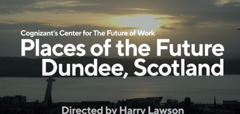

BT has announced plans to develop a brand new, multi-million pound contact centre in Dundee that will become the new home to around 1,000 employees. It’s the latest vote of confidence in the city following the recent announcement of the roll-out of 5G by BT’s EE on the back of further full fibre network developed by BT Openreach.

Dundee is a dynamic, modern city, leading one of the largest regeneration projects in the UK. It is one of the principal tech centres in the country. Selected by industry group Tech Nation as one of the three cities most likely to become a UK tech hub this year, Dundee was also named alongside around 20 major world cities such as Toronto, São Paulo and Atlanta by multinational tech company Cognizant as[ one of the world’s top “places of the future](/file/dundee-21-places-future-center-future-work-cognizant)”, in a report examining how new technologies will create jobs.

The new office will be at West Marketgait in the heart of the city centre, close to the waterfront and part of a £1bn regeneration area. It will be Dundee’s first ever ‘Platinum Wired Scored’ building. So it will be at the forefront of IT and connectivity resilience and sustainablility and consist of two buildings with 76,500sq.ft (7,108sq.m) of offices for BT plus cafes, retail and accomodation.

The building is expected to be ready in 2023 hosting a state-of-the art contact centre as one of around 30 of BT’s new future-fit offices in the UK, developed as part of its ‘Better Workplace Programme’ – the largest workplace improvement and consolidation scheme of its type ever undertaken in the UK. The investment will help transform the way BT works, create efficiencies and enable it to better serve its customers.

BT has had a major presence in the city since 1976. The building, a new addition to the portfolio of Crucible Developments, will include what the designers have described as a ‘street landscape,’ with areas for colleagues to socialise while enjoying great views over Dundee and the River Tay.

Teams based in Dundee include those providing customer service support to BT’s full fibre customers and small businesses.

BT Group is the UK’s leading telecommunications and network provider and a leading provider of global communications services and solutions, serving customers in 180 countries. In the UK services include fixed and mobile coommunications and TV (including BT Sport) plus a whole range of business and consumer solutions. Globally, BT provides managed services, security and network and IT infrastructure services to support their operations all over the world. BT’s Openreach provides access network services to over 650 communications clients.

Jane Wood, BT Group Scotland director, said: “This is exciting news for my colleagues in Dundee and reflects BT’s continued investment in Scotland. As one of the largest employers in Tayside, we know that this investment will be welcomed by many people, not least my colleagues who will be based at this brilliantly designed new office. We’re pleased that Dundee, an iconic Scottish city, will remain home to nearly 1,000 frontline workers who help customers right across the UK, every day. My colleagues have done an amazing job ensuring that our customers have stayed connected during the Covid -19 pandemic, with some choosing to remain working on site, while other colleagues have chosen to work from home. We look forward to welcoming staff into our new building when it’s complete.”

Cognizant - see video of [one of the world’s top “places of the future](/file/dundee-21-places-future-center-future-work-cognizant)"

John Alexander, Leader of Dundee City Council, said: “Today's announcement by BT is a huge vote of confidence in the city and in our plans for the future. It is clear that BT shares our vision for a Dundee that has a strong and sustainable economy providing jobs, retaining more graduates and making the city a magnet for new talent, while at the same time offering real choice and opportunity in a place that has tackled the root causes of social and economic exclusion. The company will be an integral part of that journey with us and I am delighted that BT sees Dundee as a good place to do business and recruit its present and future workforce."

Michael Smart at Crucible Developments, said: “We are delighted to have secured BT as an occupier. The site is undoubtedly one of the best in Dundee and we are extremely proud of the building our team have created. We hope to commence construction as soon as possible and, once completed, the development will bring a prominent brownfield site back into use and further increase the vibrancy of Dundee city centre.”

BT Group plays an important role in the Scottish economy and is responsible for generating £1 in every £115 produced in the country, according to an independent report. It also generated £1.2 billion to the economy of Scotland in “Gross Value Added” GVA, during the 2019/20 financial year.\* BT Group supports more than 12,400 jobs across the nation.

Under the five-year ‘Better Workplace Programme’, first announced in 2018, BT will consolidate its UK footprint of more than 300 locations to around 30.

Working with Scottish Enterprise and property company Camlin, part-owned by Dundee property entrepreneur Bruce Linton, Crucible Developments have assembled the site and designedThe Greenmarket development comprise two buildings providing 76,500sq.ft (7,108sq.m) of offices, prelet to BT; 6,500sq.ft(602sq.m) of café/retail amenities and 16 flats.

Dundee Waterfront is an award-winning £1 billion regeneration project that is transforming 240 acres of land along 8km of the River Tay. Split into five distinct zones, the project has secured more than £750m of committed investment including a £40m investment by Dundee Port to secure offshore wind and decommissioning work. Most infrastructure works have been completed and the build phase is well underway, with a growing community of businesses and residents moving into the Waterfront area. Major projects already completed include the construction of a new railway station, V&A Dundee and Agnes Husband House, the new HQ for Social Security Scotland.

Dundee is home to two universities, is the UK's only UNESCO City of Design and world-class computer games developers, life sciences research and the emerging sectors of cyber security and low carbon industries are driving its economic growth. Dundee is also at the heart of the £700m Tay Cities Deal which will boost economic prosperity in the city and surrounding areas.

A full BT Economic Impact Report is available at: [www.bt.com/reports](https://protect-eu.mimecast.com/s/LZkXCPzwNi4WN7zh0JMf8?domain=bt.com)

