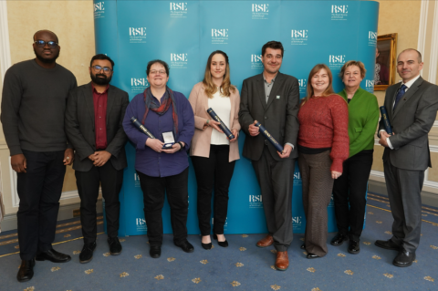

The University of Dundee's efforts to enhance scientific standards within the justice system have received recognition from Scotland's National Academy. The Royal Society of Edinburgh (RSE) has awarded the **RSE Mary Somerville Medal** to the **Leverhulme Research Centre for Forensic Science**. The medal, which is awarded in alternate years to individuals or research groups, recognises the Leverhulme Centre's work to improve forensic science standards and make the criminal justice system fairer and more robust. Dundee is one of four co-funding partners in the **£10 million Leverhulme Research Centre for Forensic Science**, along with Birmingham, Manchester and UCL.

Professor Niamh Nic Daéid, Director of the Leverhulme Research Centre for Forensic Science, said: "The Leverhulme Research Centre for Forensic Science and its partner institutions have had an enormous impact on the UK forensic science sector and beyond since their establishment. It is a real honour that this has been reflected in this award by the RSE. This award is a credit to the huge amount of effort put in by colleagues from all across the Centre - from the senior leadership team to the PhD students - and is also a reflection on the many external stakeholders who share our goals of scientific excellence and innovation in justice systems globally."

Duncan Sommerville, CEO of the Royal Society of Edinburgh said: "The RSE Mary Somerville Medal has been awarded to the Leverhulme Research Centre for Forensic Science in recognition of the innovation and impact of their work in strengthening forensic science standards. Having shown commitment to public engagement with this crucial area of science, and demonstrating innovation in how best to communicate its complex nature, we are delighted to award our outreach and engagement prize to the Centre and applaud its efforts to involve citizens in this important discussion. As the National Academy of Scotland, we at RSE are committed to promoting excellence in scientific research and making Scotland a place where the value of science is recognised by all."

The Mary Somerville Medal is named after the pioneering 19th century Scottish scientist, writer and polymath. It celebrates excellence and impact in relation to research engagement and the public communication of science.

